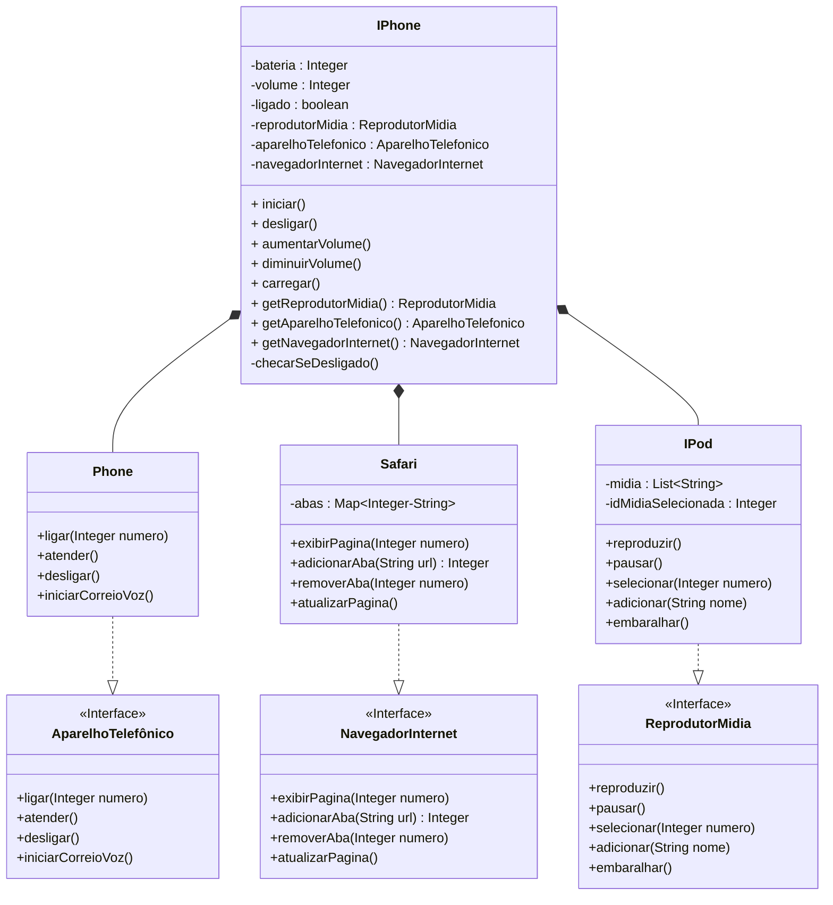

<h1>Modelagem UML das classes</h1>

```mermaid
classDiagram

    class IPhone{
        -bateria : Integer
        -volume : Integer
        -ligado : boolean
        -reprodutorMidia : ReprodutorMidia
        -aparelhoTelefonico : AparelhoTelefonico
        -navegadorInternet : NavegadorInternet
        + iniciar()
        + desligar()
        + aumentarVolume()
        + diminuirVolume()
        + carregar()
        + getReprodutorMidia() ReprodutorMidia
        + getAparelhoTelefonico() AparelhoTelefonico
        + getNavegadorInternet() NavegadorInternet
        -checarSeDesligado()
    }

    IPhone *-- Phone
    IPhone *-- Safari
    IPhone *-- IPod
    Phone ..|> AparelhoTelefônico
    Safari ..|> NavegadorInternet
    IPod ..|> ReprodutorMidia

    class AparelhoTelefônico{
      <<Interface>>
      +ligar(Integer numero)
      +atender()
      +desligar()
      +iniciarCorreioVoz()
    }
    class Phone{
      +ligar(Integer numero)
      +atender()
      +desligar()
      +iniciarCorreioVoz()
    }
    class NavegadorInternet{
      <<Interface>>
      +exibirPagina(Integer numero)
      +adicionarAba(String url) Integer
      +removerAba(Integer numero)
      +atualizarPagina()
    }
    class Safari{
      -abas : Map~Integer-String~
      +exibirPagina(Integer numero)
      +adicionarAba(String url) Integer
      +removerAba(Integer numero)
      +atualizarPagina()
    }
    class ReprodutorMidia{
      <<Interface>>
      +reproduzir()
      +pausar()
      +selecionar(Integer numero)
      +adicionar(String nome)
      +embaralhar()
    }
    class IPod{
      -midia : List~String~
      -idMidiaSelecionada : Integer
      +reproduzir()
      +pausar()
      +selecionar(Integer numero)
      +adicionar(String nome)
      +embaralhar()
    }
```